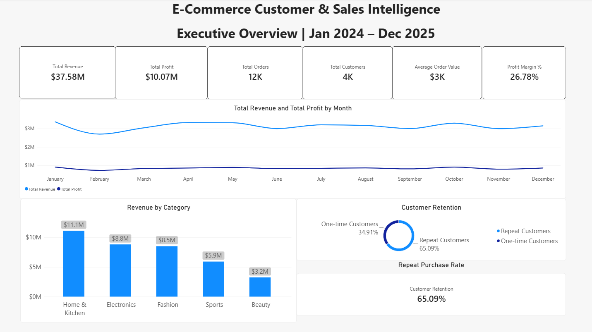
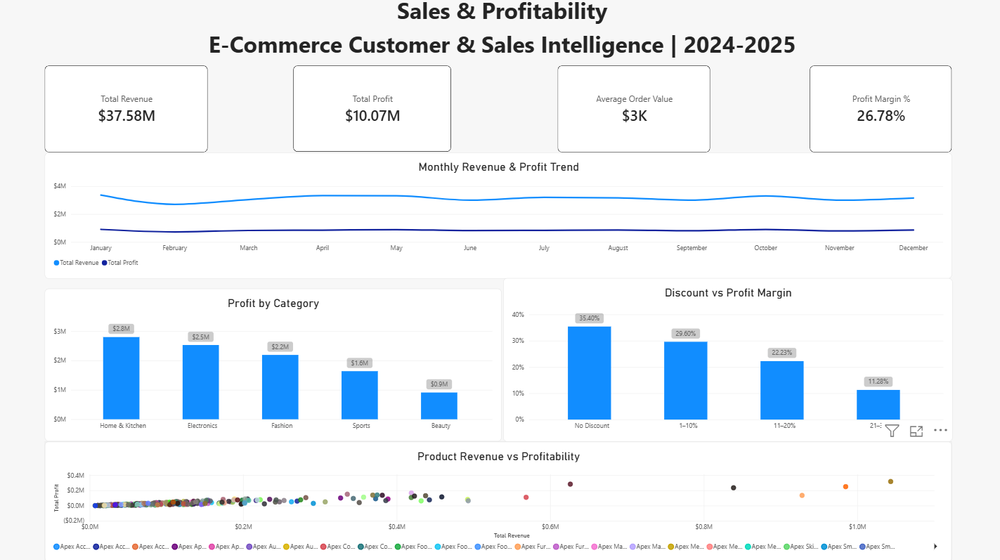
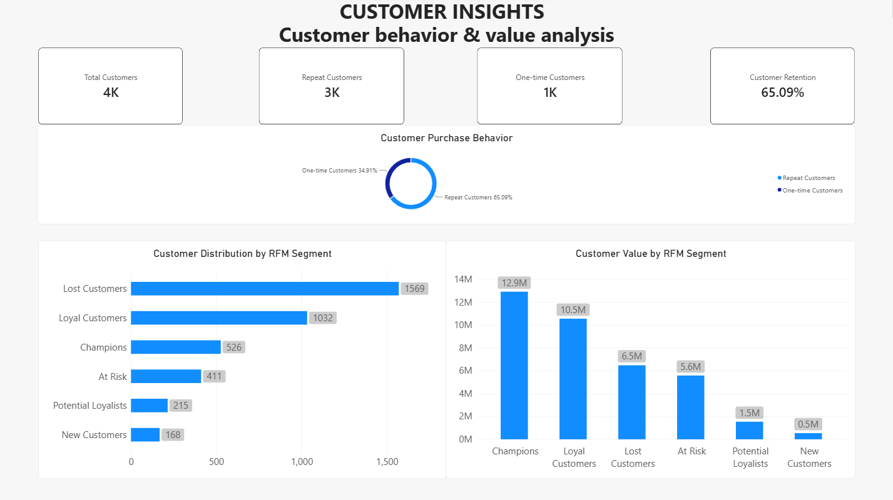
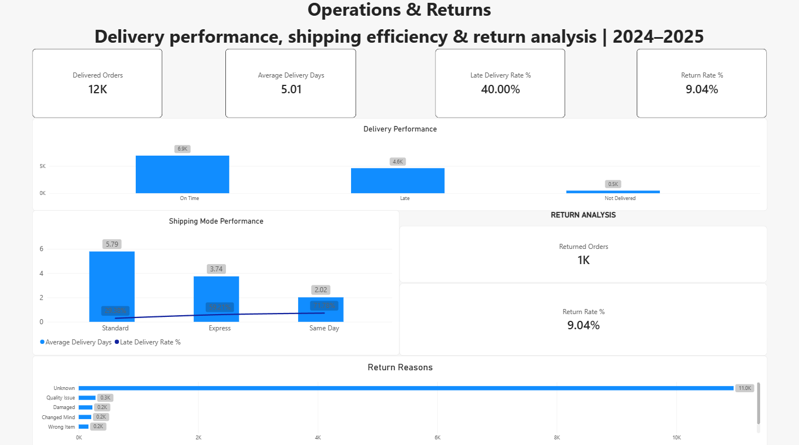

# E-Commerce Customer & Sales Intelligence — Power BI Dashboard

An interactive Power BI dashboard developed to analyze e-commerce sales, profitability, customer behavior, RFM segments, delivery performance, shipping efficiency, and product returns.

This Power BI dashboard is one phase of the larger **E-Commerce Customer & Sales Intelligence** end-to-end data analytics project.

---

## 📊 Project Overview

The objective of this dashboard is to transform e-commerce transaction data into interactive business insights that can help stakeholders understand:

* Overall sales and profitability
* Revenue and profit trends
* Category performance
* Discount impact on profitability
* Customer retention and repeat purchasing
* Customer value and RFM segments
* Delivery performance
* Shipping-mode efficiency
* Product return patterns
* Major return reasons

The dashboard was developed using **Power BI Desktop, Power Query, DAX, and data modeling**.

---

# 🎯 Business Problem

An e-commerce company needs to understand not only how much it sells, but also what drives revenue, profitability, customer retention, delivery performance, and returns.

This dashboard addresses questions such as:

* How much revenue and profit did the business generate?
* Which product categories contribute the most revenue and profit?
* How does discounting affect profitability?
* How many customers are repeat customers?
* Which customer segments are valuable or at risk?
* Which shipping modes experience delivery problems?
* How frequently are orders returned?
* What are the major reasons for product returns?

---

# 🗂️ Dashboard Pages

## 1. Executive Overview

Provides a high-level summary of overall business performance.

### Key Metrics

* Total Revenue
* Total Profit
* Total Orders
* Average Order Value
* Profit Margin
* Total Customers
* Repeat Purchase Rate

### Visuals

* Monthly Revenue & Profit Trend
* Revenue by Category
* Customer Retention / Customer Type

### Dashboard Screenshot



---

## 2. Sales & Profitability

Focuses on revenue generation, profitability, product performance, and discount impact.

### Key Metrics

* Total Revenue
* Total Profit
* Average Order Value
* Profit Margin

### Visuals

* Monthly Revenue & Profit Trend
* Profit by Category
* Discount vs Profit Margin
* Product Revenue vs Profitability

### Dashboard Screenshot



---

## 3. Customer Insights

Focuses on customer purchasing behavior, retention, customer value, and RFM segmentation.

### Key Metrics

* Total Customers
* Repeat Customers
* One-time Customers
* Repeat Purchase Rate

### Visuals

* Customer Purchase Behavior
* RFM Customer Segments
* Customer Value by RFM Segment

### RFM Dimensions

* Recency
* Frequency
* Monetary Value

### Customer Segments

* Champions
* Loyal Customers
* Potential Loyalists
* New Customers
* At Risk
* Lost Customers

### Dashboard Screenshot



---

## 4. Operations & Returns

Focuses on delivery performance, shipping efficiency, and product returns.

### Key Metrics

* Delivered Orders
* Average Delivery Days
* Late Delivery Rate
* Returned Orders
* Return Rate

### Visuals

* Delivery Performance
* Shipping Mode Performance
* Return Analysis
* Return Reasons

### Dashboard Screenshot



---

# 📈 Key Business Metrics

The Power BI dashboard was validated against the underlying SQL analysis.

| Metric                |         Result |
| --------------------- | -------------: |
| Total Orders          |         12,000 |
| Units Sold            |         21,391 |
| Total Revenue         | ₹37,584,345.33 |
| Total Profit          | ₹10,065,866.56 |
| Average Order Value   |      ₹3,132.03 |
| Profit Margin         |         26.78% |
| Purchasing Customers  |          3,921 |
| Repeat Customers      |          2,552 |
| One-time Customers    |          1,369 |
| Repeat Purchase Rate  |         65.09% |
| Delivered Orders      |         11,521 |
| Average Delivery Days |           5.01 |
| Late Delivery Rate    |         40.00% |
| Returned Orders       |          1,042 |
| Return Rate           |          8.68% |

---

# 💡 Key Business Insights

## 1. Strong overall profitability

The business generated approximately **₹3.76 crore in revenue** and **₹1.01 crore in profit**, resulting in an overall profit margin of approximately **26.78%**.

---

## 2. Profit grew faster than revenue

Between 2024 and 2025:

* Revenue increased by approximately **2.11%**
* Profit increased by approximately **4.04%**

This provides an opportunity to investigate the effects of product mix, discounting, and cost management on profitability.

---

## 3. Home & Kitchen is the largest revenue category

Home & Kitchen generated approximately **₹1.11 crore in revenue**, making it the largest revenue-generating category.

Electronics generated lower revenue than Home & Kitchen but achieved a higher profit margin.

---

## 4. Higher discounts are associated with lower profit margins

| Discount Level | Profit Margin |
| -------------- | ------------: |
| No Discount    |        35.40% |
| 1–10%          |        29.60% |
| 11–20%         |        22.23% |
| 21–30%         |        11.28% |

The analysis shows a substantial decline in profit margin as discount levels increase.

---

## 5. Repeat customers represent a substantial customer base

The analysis identified:

* 3,921 purchasing customers
* 2,552 repeat customers
* 1,369 one-time customers

The resulting repeat purchase rate is **65.09%**.

---

## 6. Delivery performance requires attention

Delivery results:

* On Time: 6,913 orders
* Late: 4,608 orders
* Not Delivered: 479 orders

The calculated late delivery rate among delivered orders is **40.00%**.

---

## 7. Shipping modes show different delivery patterns

| Shipping Mode | Average Delivery Days | Late Rate |
| ------------- | --------------------: | --------: |
| Same Day      |                  2.02 |    71.78% |
| Express       |                  3.74 |    59.21% |
| Standard      |                  5.79 |    29.38% |

These results can be further investigated alongside carrier performance, fulfillment operations, warehouse processes, and service-level expectations.

---

## 8. Returns are a meaningful operational metric

The analysis identified **1,042 returned orders**, resulting in a return rate of **8.68%**.

The dashboard breaks down return reasons to identify areas for further investigation.

---

## 9. Quality issues and damaged products are major return reasons

| Return Reason | Returned Orders |
| ------------- | --------------: |
| Quality Issue |             281 |
| Damaged       |             229 |
| Changed Mind  |             210 |
| Wrong Item    |             163 |
| Late Delivery |             159 |

Quality-related and damage-related returns represent important areas for further investigation.

---

# 📌 Business Recommendations

Based on the analysis, the following areas can be considered for further business investigation:

### 1. Review high-discount transactions

Establish discount or margin thresholds to identify transactions where discounts significantly reduce profitability.

### 2. Investigate delivery delays

Analyze late deliveries by shipping mode, location, carrier, warehouse, and time period to identify potential operational causes.

### 3. Strengthen customer retention

Use RFM segments to develop different engagement and reactivation strategies for Champions, Loyal Customers, Potential Loyalists, At Risk Customers, and Lost Customers.

### 4. Investigate product quality and damage

Review products and categories associated with high numbers of quality-related and damaged returns.

### 5. Review high-revenue but low-profit products

Investigate products with strong sales but weak or negative profitability by examining pricing, product cost, discounting, shipping costs, and returns.

---

# 🧮 DAX Measures

The dashboard uses DAX measures for KPI calculations and analytical metrics.

### Total Revenue

```DAX
Total Revenue =
SUM(orders[sales_amount])
```

### Total Profit

```DAX
Total Profit =
SUM(orders[profit])
```

### Total Orders

```DAX
Total Orders =
DISTINCTCOUNT(orders[order_id])
```

### Units Sold

```DAX
Units Sold =
SUM(orders[quantity])
```

### Average Order Value

```DAX
Average Order Value =
DIVIDE([Total Revenue], [Total Orders])
```

### Profit Margin

```DAX
Profit Margin % =
DIVIDE([Total Profit], [Total Revenue])
```

### Repeat Purchase Rate

```DAX
Repeat Purchase Rate % =
DIVIDE(
    [Repeat Customers],
    [Total Customers]
)
```

### Delivered Orders

```DAX
Delivered Orders =
CALCULATE(
    DISTINCTCOUNT(order_delivery_returns[order_id]),
    order_delivery_returns[delivery_status] <> "Not Delivered"
)
```

### Average Delivery Days

```DAX
Average Delivery Days =
CALCULATE(
    AVERAGE(order_delivery_returns[delivery_days]),
    order_delivery_returns[delivery_status] <> "Not Delivered"
)
```

### Late Delivery Rate

```DAX
Late Delivery Rate % =
DIVIDE(
    CALCULATE(
        DISTINCTCOUNT(order_delivery_returns[order_id]),
        order_delivery_returns[delivery_status] = "Late"
    ),
    [Delivered Orders]
)
```

### Return Rate

```DAX
Return Rate % =
DIVIDE(
    [Returned Orders],
    [Delivered Orders]
)
```

Additional DAX calculations were created for:

* Customer Type
* One-time Customers
* Discount Buckets
* RFM Scores
* RFM Segments
* Segment Revenue
* Average Customer Value

---

# 🧠 RFM Analysis

Customer segmentation was performed using three dimensions:

### Recency

How recently a customer made a purchase.

### Frequency

How frequently a customer placed orders.

### Monetary

How much revenue a customer generated.

These scores were used to classify customers into business-oriented segments such as:

* Champions
* Loyal Customers
* Potential Loyalists
* New Customers
* At Risk
* Lost Customers

The segmentation can support targeted customer retention and reactivation strategies.

---

# 🗃️ Data Model

The Power BI model contains four primary tables:

```text
customers
    │
    │ 1 → *
    ▼
orders
    ▲
    │
    │ * ← 1
products

orders
    │
    │ 1 → 1
    ▼
order_delivery_returns
```

### Main Relationships

```text
customers.customer_id
        ↓
orders.customer_id

products.product_id
        ↓
orders.product_id

orders.order_id
        ↓
order_delivery_returns.order_id
```

The model connects customer, product, order, delivery, and return information for integrated analysis.

---

# 🧹 Data Preparation

The datasets were cleaned and validated before being used in Power BI.

Data preparation included:

* Missing-value handling
* Data-type correction
* Duplicate-record checks
* Text standardization
* Date validation
* Numeric validation
* Referential-integrity checks

The Power BI dashboard uses the cleaned SQL-ready datasets.

---

# 🛠️ Tools & Technologies

### Primary Tools

* Power BI Desktop
* Power Query
* DAX
* Power BI Data Modeling

### Supporting Project Technologies

* MySQL
* SQL
* Python
* Pandas
* NumPy
* Matplotlib
* Seaborn
* Tableau

---

# 📂 Repository Structure

```text
ecommerce-customer-sales-powerbi-dashboard/
│
├── screenshots/
│   ├── executive-overview.png
│   ├── sales-profitability.png
│   ├── customer-insights.png
│   └── operations-returns.png
│
├── E-Commerce_Customer_Sales_Intelligence.pbix
│
└── README.md
```

---

# 🔗 Related Project Phases

This Power BI dashboard is part of the larger **E-Commerce Customer & Sales Intelligence** project.

### SQL Analysis

Business-focused e-commerce sales, customer, profitability, delivery, and returns analysis using MySQL.

### Python Analysis

Exploratory data analysis, profitability analysis, customer behavior, RFM segmentation, delivery, and returns analysis using Python.

### Power BI Dashboard

Interactive dashboard combining the project's analytical results into four business-focused pages.

### Tableau

A separate business-storytelling layer will be developed using the same analytical foundation.

---

# 🎯 Project Outcome

This Power BI phase demonstrates the ability to:

* Build a relational data model
* Create business-focused KPIs
* Write DAX measures
* Perform customer segmentation
* Analyze sales and profitability
* Analyze discount impact
* Analyze delivery performance
* Analyze shipping efficiency
* Analyze product returns
* Build interactive dashboards
* Translate analytical results into business insights
* Present data in a recruiter-friendly dashboard format

The dashboard is designed as part of an end-to-end analytics portfolio project rather than as an isolated visualization exercise.

---
